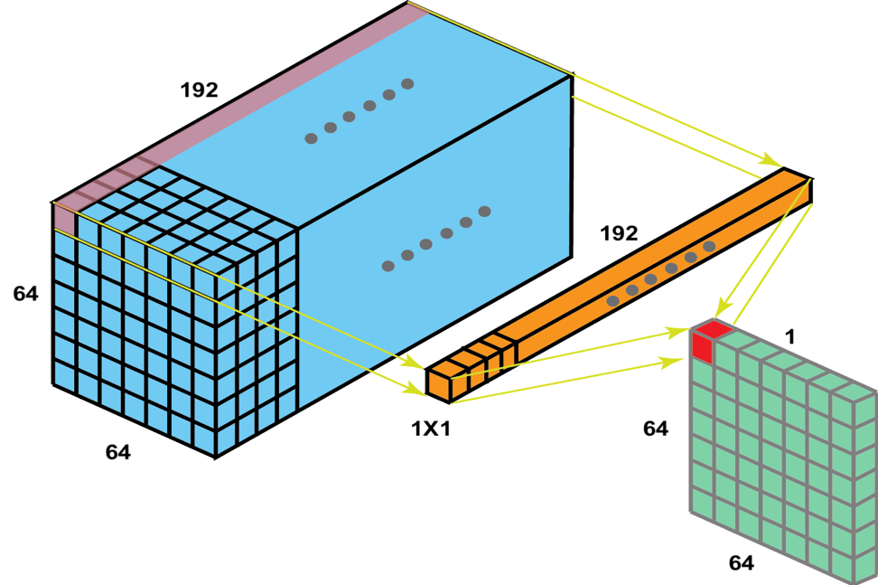
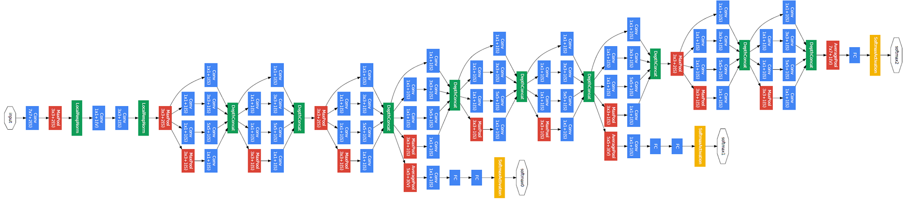

# GoogleNet/Inception V1

## 1. Introdução

A GoogleNet, também conhecida como Inception V1, é uma arquitetura de rede neural convolucional que foi introduzida pela primeira vez no ImageNet Large Scale Visual Recognition Challenge (ILSVRC) 2014. Com 22 camadas de profundidade, a GoogleNet é significativamente mais profunda do que as arquiteturas anteriores, como a AlexNet e a ZF-Net, mas é computacionalmente mais eficiente devido à introdução do módulo Inception. Este módulo permite que a rede adapte o tamanho do filtro convolucional em cada camada, otimizando assim o uso dos recursos computacionais.

## 2. Características da GoogleNet

### 2.1 Convoluções 1x1

As convoluções 1x1, também conhecidas como convoluções de ponto, são uma característica distintiva da GoogleNet. Elas são usadas para reduzir a dimensionalidade dos mapas de características intermediários sem perder a informação espacial. Matematicamente, uma convolução 1x1 pode ser expressa como:

$$F_{out}(i,j) = \sum_{k} F_{in}(i,j,k) \cdot W(k)$$

onde $F_{in}$ é o mapa de características de entrada, $W$ é o conjunto de pesos da convolução 1x1 e $F_{out}$ é o mapa de características de saída.

### 2.2 Pooling Médio Global

Na camada final da GoogleNet, o pooling médio global é empregado para reduzir a dimensionalidade dos mapas de características. Diferentemente das técnicas tradicionais de pooling que resumem as informações em uma janela deslizante, o pooling médio global calcula a média de cada mapa de características inteiro. Isso resulta em um único valor por mapa e é expresso matematicamente como:

$$F_{out}(k) = \frac{1}{N} \sum_{i=1}^{N} \sum_{j=1}^{N} F_{in}(i,j,k)$$

onde $F_{in}$ é o mapa de características de entrada, $N$ é a dimensão do mapa de características e $F_{out}$ é o vetor de características de saída.

## 3 Módulo Inception

O Módulo Inception é uma das principais inovações introduzidas pela GoogleNet. Diferente das arquiteturas anteriores como AlexNet e ZF-Net, que usam um tamanho fixo de filtro convolucional em cada camada, o Módulo Inception permite que a rede escolha entre vários tamanhos de filtros convolucionais em cada bloco.

No Módulo Inception, convoluções 1x1, 3x3, 5x5 e um pooling máximo 3x3 são realizados em paralelo na entrada. Os resultados dessas operações são então concatenados para gerar a saída final. Isso é ilustrado na figura abaixo:

A ideia por trás disso é que filtros convolucionais de diferentes tamanhos podem ser capazes de capturar objetos em várias escalas de maneira mais eficaz. Por exemplo, enquanto um filtro 1x1 pode ser eficaz para capturar detalhes finos em uma imagem, um filtro 5x5 pode ser melhor para capturar características de nível superior ou mais abstratas.

Portanto, ao permitir que a rede escolha entre vários tamanhos de filtros convolucionais em cada bloco, o Módulo Inception aumenta a flexibilidade da rede e permite que ela se adapte melhor às características específicas das imagens de entrada.

## 4 Estrutura Geral da Arquitetura GoogleNet

A GoogleNet é composta por uma série de módulos Inception empilhados, cada um dos quais é uma mini rede neural em si. A arquitetura geral da GoogleNet é ilustrada na figura abaixo:

A GoogleNet começa com algumas camadas convolucionais e de pooling padrão antes de entrar nos módulos Inception. Existem nove módulos Inception na GoogleNet, cada um com uma série de operações de convolução e pooling realizadas em paralelo. Os resultados dessas operações são então concatenados ao longo da dimensão do canal para formar a saída do módulo.

Após os módulos Inception, a GoogleNet usa o pooling médio global para reduzir a dimensionalidade dos mapas de características antes da camada de classificação final. A camada de classificação usa uma função softmax para produzir as probabilidades finais da classe.

A GoogleNet também introduziu duas classificações auxiliares durante o treinamento para combater o problema do desaparecimento do gradiente em redes profundas. Essas classificações auxiliares são colocadas após o terceiro e sexto módulos Inception e são usadas apenas durante o treinamento. Elas fornecem um sinal de gradiente adicional para as camadas inferiores da rede durante a retropropagação.

A estrutura geral da GoogleNet permite que ela capture uma ampla gama de características em diferentes escalas, tornando-a eficaz para uma variedade de tarefas de visão computacional.

## 5 Conclusão

A GoogleNet é uma arquitetura de rede neural convolucional inovadora que introduziu várias novas ideias para o campo da aprendizagem profunda. Com a introdução de convoluções 1x1 para redução de dimensionalidade e o Módulo Inception para adaptar o tamanho do filtro convolucional, a GoogleNet foi capaz de alcançar um desempenho impressionante no ILSVRC 2014. Além disso, a GoogleNet é notável por sua eficiência computacional, tornando-a uma escolha popular para aplicações de aprendizagem profunda em tempo real.